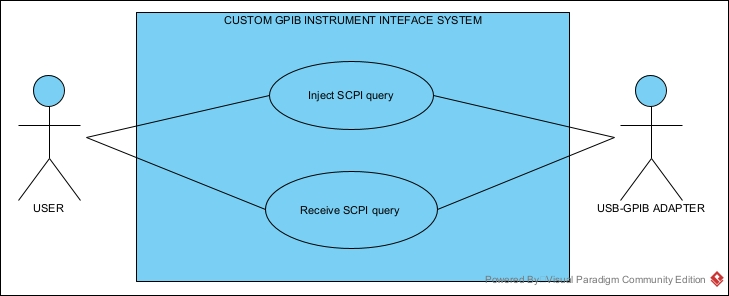

# GPIB_INTERFACE
Development of a GPIB based interface to communicate with benchtop lab equipment through SCPI commands.

As basys, this project consists of a C++ with QT interface, to be able to generate SCPI queries for multiples workbench instruments, thus automating measurements workflow.

In this case, this interface will use a USB-GPIB adapter, like shown below, although there can be other variations like e.g. ethernet-GPIB, this will be the cheapest and quickest development path to be taken. 

